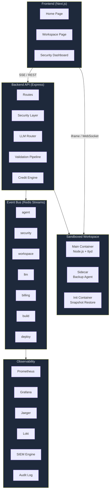
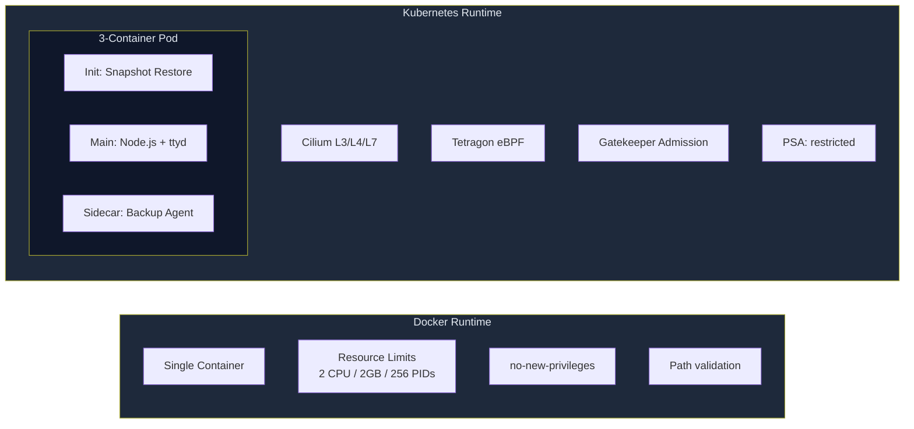
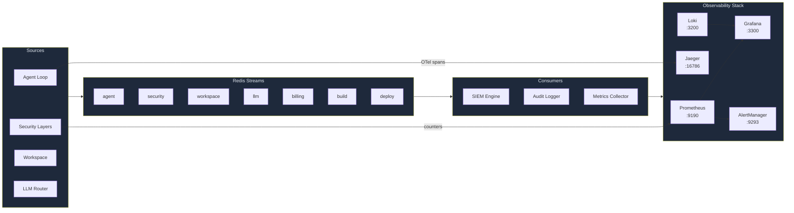
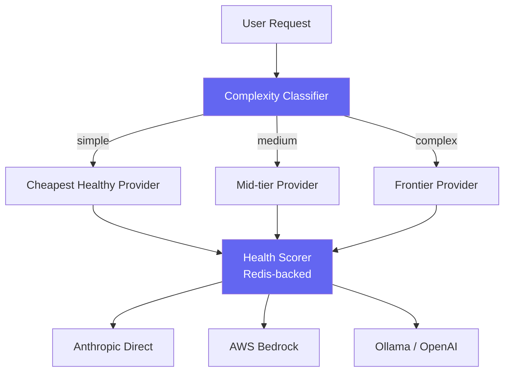
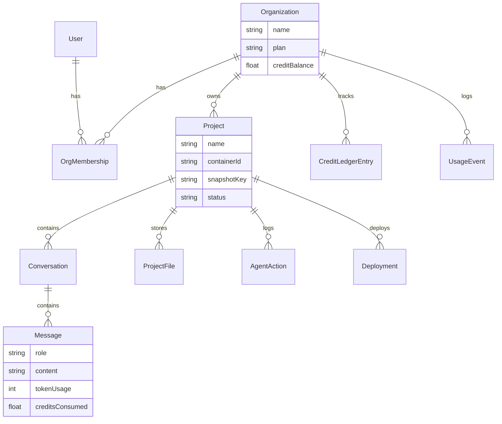

# secure-codegen-factory

> Security-first AI code generation platform — 16 defense-in-depth layers wrapping untrusted LLMs in sandboxed workspaces.

Users describe an application in natural language. An AI agent builds it inside an isolated container with live preview, file editing, and terminal access. Every stage of the pipeline — from user input through LLM inference, code generation, tool execution, and deployment — is wrapped by independent security controls that assume the model is adversarial.

```mermaid
flowchart LR
    U[User Prompt] --> IF[Input Firewall]
    IF --> PID[Injection Detector]
    PID --> IC[Intent Classifier]
    IC --> SD[Secret Detector]
    SD --> LLM[LLM Agent]
    LLM --> OF[Output Filter]
    OF --> PF[Package Filter]
    PF --> WS[Sandboxed Workspace]
    WS --> VAL[Validation Pipeline]
    VAL --> SIEM[SIEM Engine]
    SIEM --> OBS[Observability Stack]

    style IF fill:#ef4444,color:#fff
    style PID fill:#ef4444,color:#fff
    style IC fill:#ef4444,color:#fff
    style SD fill:#ef4444,color:#fff
    style OF fill:#f97316,color:#fff
    style PF fill:#f97316,color:#fff
    style WS fill:#3b82f6,color:#fff
    style VAL fill:#8b5cf6,color:#fff
    style SIEM fill:#10b981,color:#fff
    style OBS fill:#10b981,color:#fff
```



---

## Why This Exists

The core thesis: **treat the LLM as an untrusted, non-deterministic actor**. Security doesn't rely on model safety training — 16 independent layers inspect inputs, outputs, commands, packages, code, and runtime behavior. A bypass of any single layer does not compromise the system.

**Design principles:**
- **Model-agnostic security** — The LLM is a black box. Controls work identically whether the model is safety-trained or an uncensored open-weight model.
- **Control plane / data plane separation** — The backend orchestrates; workspaces execute. A compromised workspace cannot reach the control plane.
- **Deterministic policy outside the model** — The agent proposes, the engine validates. Every tool call, file write, package install, and deploy goes through explicit policy checks.
- **Observable by default** — Every security-relevant event flows through Redis Streams → SIEM → Audit Log → Prometheus → Grafana.
- **Compound controls** — Prompt injection detection, intent classification, output filtering, code scanning, behavioral analysis, and runtime monitoring each catch different attack classes.

---

## Architecture Overview



---

## Defense in Depth: The 16 Security Layers

```mermaid
flowchart TB
    subgraph PreLLM["Pre-LLM (Input Validation)"]
        direction LR
        L1["1. Input Firewall<br/><small>Regex + heuristic scoring</small>"]
        L2["2. Injection Detector<br/><small>12 attack categories</small>"]
        L3["3. Intent Classifier<br/><small>7-signal semantic fusion</small>"]
        L4["4. Secret Detector<br/><small>Pattern + entropy</small>"]
        L16["16. System Prompt Hardening<br/><small>Safety sandwich + canary</small>"]
    end

    subgraph PostLLM["Post-LLM (Output Validation)"]
        direction LR
        L5["5. Output Filter<br/><small>28 block + 15 alert patterns</small>"]
        L6["6. Package Filter<br/><small>Supply chain gate</small>"]
    end

    subgraph Runtime["Runtime (Behavioral)"]
        direction LR
        L7["7. Trajectory Monitor<br/><small>Per-session risk scoring</small>"]
        L8["8. Behavioral Detector<br/><small>LLM session classification</small>"]
    end

    subgraph CodeScan["Post-Build (Code Analysis)"]
        direction LR
        L9["9. SAST Scanner<br/><small>20+ code patterns</small>"]
        L10["10. SCA Scanner<br/><small>npm audit</small>"]
        L11["11. Secret Scanner<br/><small>Bulk file scanning</small>"]
        L12["12. SBOM Generator<br/><small>Dependency tree</small>"]
        L13["13. Image Scanner<br/><small>Trivy-based</small>"]
    end

    subgraph Detection["Detection & Response"]
        direction LR
        L14["14. Runtime Correlator<br/><small>Pod → session mapping</small>"]
        L15["15. SIEM Rules Engine<br/><small>10 detection + 3 correlation</small>"]
    end

    PreLLM --> PostLLM --> Runtime --> CodeScan --> Detection

    style PreLLM fill:#7f1d1d,color:#fecaca
    style PostLLM fill:#7c2d12,color:#fed7aa
    style Runtime fill:#713f12,color:#fef08a
    style CodeScan fill:#14532d,color:#bbf7d0
    style Detection fill:#1e3a5f,color:#bfdbfe
```



### Security Layer Reference

| # | Layer | Phase | Technique | What It Catches | Latency |
|---|-------|-------|-----------|-----------------|---------|
| 1 | **Input Firewall** | Pre-LLM | Regex patterns + heuristic scoring | Prompt injection, role-play markers, base64 instructions, delimiter injection | <5ms |
| 2 | **Injection Detector** | Pre-LLM | Deep pattern analysis (12 attack categories) | DAN/jailbreak, system prompt extraction, role hijacking, encoding evasion, token smuggling | <10ms |
| 3 | **Intent Classifier** | Pre-LLM | 7-signal semantic fusion | Reconnaissance, privilege escalation, exfiltration, resource abuse, evasion, sabotage | <20ms |
| 4 | **Secret Detector** | Pre-LLM | Pattern matching + Shannon entropy | AWS keys, API tokens, private keys, high-entropy strings | <5ms |
| 5 | **Output Filter** | Post-LLM | 28 BLOCK + 15 ALERT patterns | Reverse shells, pipe-to-shell, metadata SSRF, container escape, destructive commands | <2ms |
| 6 | **Package Filter** | Post-LLM | Blocklist + typosquatting + age/popularity | Malicious packages, typosquatting, packages <7 days old or <50 weekly downloads | <100ms |
| 7 | **Trajectory Monitor** | Runtime | Per-session risk scoring (5-turn windows) | Progressive boundary testing, accumulated suspicious behavior | <50ms |
| 8 | **Behavioral Detector** | Runtime | LLM-based session classification | NORMAL / SUSPICIOUS / MALICIOUS session patterns | <500ms |
| 9 | **SAST Scanner** | Post-build | Pattern-based static analysis (20+ rules) | eval(), innerHTML, SQL injection, command injection, hardcoded credentials | Variable |
| 10 | **SCA Scanner** | Post-build | npm audit JSON parser | Known dependency vulnerabilities (CVSS, CWE) | Variable |
| 11 | **Secret Scanner** | Post-build | TruffleHog-style pattern matching | Secrets committed to source files | Variable |
| 12 | **SBOM Generator** | Post-build | package.json/lock analysis | Full dependency tree for compliance | <100ms |
| 13 | **Image Scanner** | Pre-deploy | Trivy-based container scanning | OS package vulnerabilities, base image misconfigurations | Variable |
| 14 | **Runtime Correlator** | Runtime | Pod label enrichment | Maps K8s pod events → project/user/session for enriched alerts | <10ms |
| 15 | **SIEM Rules Engine** | Runtime | 10 detection + 3 correlation rules on Redis Streams | Cross-layer event correlation, attack pattern detection, flood detection | <50ms |
| 16 | **System Prompt Hardening** | Pre-LLM | Safety sandwich with canary tokens | System prompt extraction, instruction hierarchy manipulation | <1ms |

### How Layers Compose

The layers are designed so that no single bypass compromises the system:

- A **prompt injection** that evades the Input Firewall (Layer 1) is caught by the Injection Detector (Layer 2) or Intent Classifier (Layer 3)
- A **malicious command** that passes the LLM is blocked by the Output Filter (Layer 5) before shell execution
- A **trojan package** that passes the Output Filter is caught by the Package Filter (Layer 6) during `npm install`
- A **gradual escalation** across multiple turns is detected by the Trajectory Monitor (Layer 7) and Behavioral Detector (Layer 8)
- A **container escape attempt** blocked at the application layer is also killed by Tetragon eBPF at the kernel level
- **All events** from every layer flow to the SIEM Engine (Layer 15) for cross-layer correlation

### OWASP LLM Top 10 Coverage

| OWASP LLM Risk | Layers Addressing It |
|----------------|---------------------|
| LLM01: Prompt Injection | 1 (Input Firewall), 2 (Injection Detector), 3 (Intent Classifier), 16 (System Prompt) |
| LLM02: Insecure Output Handling | 5 (Output Filter), 9 (SAST Scanner) |
| LLM03: Training Data Poisoning | N/A (uses external model APIs) |
| LLM04: Model Denial of Service | Credit engine rate limiting, LLM health scorer |
| LLM05: Supply Chain Vulnerabilities | 6 (Package Filter), 10 (SCA Scanner), 12 (SBOM) |
| LLM06: Sensitive Information Disclosure | 4 (Secret Detector), 11 (Secret Scanner) |
| LLM07: Insecure Plugin Design | 5 (Output Filter) — all tool calls gated |
| LLM08: Excessive Agency | 7 (Trajectory Monitor), 8 (Behavioral Detector), sandboxed workspace |
| LLM09: Overreliance | Validation pipeline (AST + build verification + autofix) |
| LLM10: Model Theft | N/A (uses external model APIs) |

---

## SIEM Rules Engine

The TypeScript SIEM engine processes Redis Stream events in real-time, applying detection rules and temporal correlation.

### Detection Rules

| Rule ID | Name | Severity | MITRE ATT&CK | What It Detects |
|---------|------|----------|---------------|-----------------|
| 100001 | Prompt injection blocked | 12 | T1059 | Input firewall blocks injection attempt |
| 100002 | Dangerous command blocked | 10 | T1059.004 | Output filter blocks shell command |
| 100003 | Secret detected in input | 8 | T1552 | Credentials found in user message |
| 100004 | Session trajectory flagged | 10 | T1078 | Risk score exceeds threshold |
| 100005 | Behavioral detector alert | 14/8 | T1059 | MALICIOUS or SUSPICIOUS classification |
| 100006 | Runtime security alert | 13 | T1611 | Tetragon eBPF event (process/file/network) |
| 100010 | LLM provider health degraded | 5 | — | Provider health score drops below threshold |
| 100014 | Enriched runtime alert | 13 | T1611 | Runtime event correlated with project/user |
| 100020 | Injection attack detected | 12 | T1059 | Deep injection detector fires |
| 100021 | Malicious intent classified | 10 | T1203 | Intent classifier flags non-benign intent |
| 100022 | High-risk intent blocked | 13 | T1203 | Intent classified as EXFILTRATION or SABOTAGE |

### Correlation Rules

| Rule ID | Name | Frequency | Timeframe | Action |
|---------|------|-----------|-----------|--------|
| 100011 | Coordinated attack pattern | 3+ security events | 5 minutes | Severity 14 alert |
| 100012 | Injection flood | 5+ injection events | 10 minutes | Severity 15 critical alert |
| 100013 | Sandbox escape sequence | 3+ command blocks | 5 minutes | Severity 14 alert |

---

## Workspace Isolation

Two runtime backends with the same API surface — Docker for development, Kubernetes for production-grade isolation.



### Docker Runtime
- **Image**: Node 20 + ttyd (authenticated terminal) + development tools
- **Resources**: 2 CPU cores, 2GB memory, 256 PIDs max
- **Security**: `no-new-privileges`, path validation restricts all operations to `/workspace`
- **Network**: Bridge network with Traefik reverse proxy for preview routing
- **Ports**: 3000 (app preview), 8080 (ttyd terminal with CSPRNG credentials)

### Kubernetes Runtime (3-Container Pod)
- **Init container**: Restores workspace snapshot from S3 (LocalStack)
- **Main container**: Node.js workspace with ttyd terminal (non-root UID 1001)
- **Sidecar**: Distroless Go backup agent — incremental snapshots to S3 every 60s
- **Security context**: `runAsNonRoot`, dropped ALL capabilities, seccomp RuntimeDefault, read-only root filesystem (sidecar)

---

## Kubernetes Security Controls

### Cilium Network Policies (9 rules)

Default-deny with explicit allow-list:

| Policy | Type | Effect |
|--------|------|--------|
| `default-deny-all` | L3/L4 | Block ALL ingress + egress (baseline) |
| `allow-dns` | L3/L4 | Permit DNS to kube-dns (53/UDP+TCP) |
| `allow-package-registries` | L7 FQDN | npm, yarn, PyPI, GitHub, Debian on 80/443 |
| `allow-system-ingress` | L3/L4 | Control plane → workspace ports 3000, 8080, 9090 |
| `allow-localstack-egress` | L3/L4 | Workspace → LocalStack S3 (4566/TCP) |
| `allow-backend-egress` | L3/L4 | Workspace → API server (4100/TCP) |
| `block-metadata-ssrf` | L3 CIDR | Block cloud metadata (169.254.169.254), K8s service CIDR |
| `deny-inter-workspace` | L3 | Tenant isolation — no pod-to-pod between workspaces |
| `l7-http-visibility` | L7 HTTP | Hubble logging for GET/POST/PUT/DELETE on 3000, 8080 |

### Tetragon eBPF Policies (5 policies)

Kernel-level enforcement with SIGKILL on escape attempts:

| Policy | Trigger | Action |
|--------|---------|--------|
| `workspace-process-monitor` | `sys_execve` | Log: escape tools, crypto miners, reverse shells, privilege escalation |
| `workspace-kill-escape` | `sys_execve` of nsenter/unshare/chroot | **SIGKILL** — immediate process termination |
| `workspace-file-monitor` | `sys_openat` | Log: /etc/shadow, /proc/self/mem, docker.sock |
| `workspace-kill-sa-token` | `sys_openat` of K8s service account tokens | **SIGKILL** — prevent token theft |
| `workspace-network-monitor` | `sys_connect` to metadata endpoints | **SIGKILL** — block SSRF to cloud metadata |

### OPA Gatekeeper Admission Control (7 constraints)

| Constraint | What It Blocks |
|-----------|---------------|
| `workspace-no-privileged` | Privileged containers |
| `workspace-require-limits` | Pods without CPU/memory limits |
| `workspace-require-seccomp` | Pods without seccomp profile |
| `workspace-require-nonroot` | Containers running as root |
| `workspace-no-host-ns` | Host PID/Network/IPC namespaces |
| `workspace-restrict-volumes` | Unrestricted volume types (hostPath) |
| `workspace-no-priv-esc` | `allowPrivilegeEscalation: true` |

### Pod Security Admission

| Namespace | Profile |
|-----------|---------|
| `devfactory-workspaces` | **restricted** (enforce + warn + audit) |
| `devfactory-system` | baseline (enforce), restricted (warn) |
| `devfactory-monitoring` | baseline (enforce), restricted (warn) |

---

## Observability



### Prometheus Metrics

| Metric | Type | Description |
|--------|------|-------------|
| `agent_iterations_total` | Counter | Agent loop iterations by project |
| `llm_call_duration_seconds` | Histogram | LLM provider latency |
| `llm_tokens_total` | Counter | Token consumption by model |
| `security_blocks_total` | Counter | Firewall/filter blocks by type |
| `behavioral_detections_total` | Counter | Behavioral detector verdicts |
| `siem_alerts_total` | Counter | SIEM rule firings by severity |
| `tool_execution_duration_seconds` | Histogram | Tool call latency |
| `active_workspaces` | Gauge | Running workspace count |
| `active_agent_sessions` | Gauge | In-progress agent sessions |
| `provider_health_score` | Gauge | LLM provider health (0-1) |
| `credits_consumed_total` | Counter | Credit usage by model |
| `workspace_creation_duration_seconds` | Histogram | Container startup latency |

### Grafana Dashboards (6)

| Dashboard | Key Panels |
|-----------|-----------|
| **Security** | Total blocked attacks (24h), blocks by layer, injection trends |
| **Agent** | Active sessions, iterations/min, tool execution breakdown |
| **LLM** | Provider health scores, latency P50/P95/P99, token burn rate |
| **Workspace** | Active workspaces, creation latency, resource utilization |
| **Network** | Cilium policy drops, Hubble flow logs, DNS queries |
| **Incidents** | Security event timeline, SIEM alert severity distribution |

### Prometheus Alert Rules (50+ rules across 5 groups)

| Group | Example Rules |
|-------|--------------|
| `security_detections` | HighInjectionRate, ContainerEscapeAttempt, ReverseShellAttempt, BehavioralMalicious |
| `app_health` | AppDown, HighErrorRate, HighLatencyP95, RedisDown |
| `infrastructure` | HighMemoryUsage, WorkspaceOOM, PossibleCryptoMining |
| `llm_health` | LLMHighLatency, LLMProviderUnhealthy, LLMTokenBudgetBurn |
| `workspace_health` | WorkspaceCreationSlow, TooManyActiveWorkspaces, AgentSessionStuck |

### Event Bus (Redis Streams)

7 domain streams with consumer groups enabling parallel consumption by the SIEM engine, audit logger, metrics collector, and alerting system:

`agent` | `security` | `workspace` | `llm` | `billing` | `build` | `deploy`

~50 event types total. Every event carries a correlation ID propagated from the originating HTTP request.

---

## LLM Router

Multi-provider routing with health-based failover and complexity classification.



| Provider | Models | Config |
|----------|--------|--------|
| Anthropic Direct | Claude Opus 4.6, Sonnet 4.6, Haiku 4.5 | `ANTHROPIC_API_KEY` |
| AWS Bedrock | Same models via Bedrock | `AWS_ACCESS_KEY_ID` + `AWS_SECRET_ACCESS_KEY` |
| Ollama (local) | Any Ollama model (default: qwen3:0.6b) | `OLLAMA_BASE_URL` |
| OpenAI Compatible | GPT-4o, GPT-4o-mini | `OPENAI_API_KEY` |

**Routing**: Complexity → Model tier → Health score → Cache affinity → Automatic failover

---

## Validation Pipeline

Every file write and build is validated before the agent loop completes:

```
File Write → [AST Validator (SWC)] → [Dependency Resolver] → Agent Completes
                                                                    ↓
                                                          [Build Verifier]
                                                                    ↓ (if fails)
                                                          [AutoFix (LLM)] → Re-verify
                                                                    ↓
                                                          Emit BuildVerified / BuildFailed
```

---

## Testing Methodology

### Test Suite Overview

| Suite | Tests | What It Validates |
|-------|-------|-------------------|
| Unit tests | 262 tests, 10 suites | All security layers, LLM router, billing, validation, events |
| Regression vectors | 48 vectors, 15 attack categories | Every security layer against known attack patterns |
| E2E pipeline | 9 tests | Full chain: API → SIEM → Prometheus → Loki |

### 48-Vector Attack Regression

The regression harness runs 48 attack vectors across 15 categories against the live security stack. Each vector specifies the payload, the expected blocking layer, and the MITRE ATT&CK mapping. The harness is designed for **model onboarding** — when switching LLM providers, run the regression to verify the new model doesn't introduce security regressions.

```bash
npm run test:security:regression          # 48 vectors
npm run test:security:regression:verbose  # with per-vector details
npm run test:security:model-regression    # compare models side-by-side
```

### Layer Detection Coverage

| Layer | Coverage | Notes |
|-------|----------|-------|
| secret_detector | 100% | All secret patterns covered |
| package_filter | 100% | Malicious + typosquatting + age/popularity |
| intent_classifier | 88% | 7 intent categories with signal fusion |
| output_filter | 86% | 28 block patterns + 15 alert patterns |
| input_firewall | 67% | Regex + heuristic (fast, broad) |
| injection_detector | 57% | 12 deep attack categories |
| network_cilium | 0% | Requires K8s cluster (`--k8s` mode) |
| runtime_tetragon | 0% | Requires K8s cluster (`--k8s` mode) |

---

## Billing System

Double-entry credit ledger with reservation pattern to prevent overdraft during async LLM calls:

1. **Reserve** credits before LLM call (estimated cost)
2. **Execute** LLM call, count actual tokens
3. **Finalize** reservation with real cost, adjust balance

| Model | Input (per 1K tokens) | Output (per 1K tokens) |
|-------|-----------------------|------------------------|
| Claude Opus 4.6 | 0.060 credits | 0.300 credits |
| Claude Sonnet 4.6 | 0.012 credits | 0.060 credits |
| Claude Haiku 4.5 | 0.001 credits | 0.005 credits |
| GPT-4o | 0.010 credits | 0.060 credits |
| GPT-4o-mini | 0.0006 credits | 0.002 credits |

Fixed costs: Build = 1.0 credit | Deploy = 5.0 credits

---

## Quick Start

```bash
# One command — installs deps, starts infra, seeds DB, builds workspace image, runs smoke tests
./scripts/bootstrap.sh

# Or with Kubernetes (Kind cluster + Cilium + Tetragon + Gatekeeper)
./scripts/bootstrap.sh --k8s
```

### Prerequisites

- **Docker** (or Colima) — running daemon required
- **Node.js 20+** — runtime for backend and frontend
- **[Ollama](https://ollama.com)** — local LLM provider (free, recommended for development)

### What Bootstrap Does

1. Checks prerequisites (Docker, Node.js, Ollama)
2. Copies `.env.example` → `.env`, pulls default Ollama model
3. Starts all Docker services (Redis, Postgres, Prometheus, Grafana, Loki, Jaeger, LocalStack, etc.)
4. Creates S3 buckets, runs DB migrations and seed
5. Builds workspace Docker image
6. Starts backend (port 4100) and frontend (port 3100)
7. Runs smoke tests (input firewall, output filter, observability)

### Manual Setup

```bash
cp .env.example .env                    # edit API keys if using cloud LLMs
npm install
docker compose -f docker-compose.yml -f docker-compose.monitoring.yml up -d
npx prisma db push && npx tsx prisma/seed.ts
docker build -f Dockerfile.workspace -t devfactory-workspace:latest .
npm run dev                             # backend (4100) + frontend (3100)
```

### Service URLs

| Service | URL | Credentials |
|---------|-----|-------------|
| Frontend | http://localhost:3100 | — |
| Backend API | http://localhost:4100/api/health | — |
| Grafana | http://localhost:3300 | admin / admin |
| Prometheus | http://localhost:9190 | — |
| Jaeger | http://localhost:16786 | — |
| Loki | http://localhost:3200 | — |
| AlertManager | http://localhost:9293 | — |
| Keycloak | http://localhost:8280 | admin / admin |
| Traefik Dashboard | http://localhost:8190 | — |
| LocalStack | http://localhost:4666 | — |

---

## Project Structure

```
secure-codegen-factory/
├── src/
│   ├── app/                          # Next.js frontend
│   │   ├── page.tsx                  # Home — project list + create
│   │   ├── project/[id]/            # Workspace page
│   │   └── admin/                   # Security dashboard
│   ├── components/
│   │   ├── workspace/               # ChatPanel, CodeEditor, PreviewPanel, TerminalPanel
│   │   └── admin/                   # SecurityDashboard
│   └── server/
│       ├── security/                # 16 security layer implementations
│       ├── llm/                     # Multi-provider router + health scorer
│       ├── routes/                  # Express API endpoints
│       ├── services/                # Workspace, docker, k8s, agent-loop, snapshot
│       ├── events/                  # Redis Streams event bus + audit logger
│       ├── observability/           # Prometheus metrics, OTel tracing, Pino logging
│       ├── validation/              # AST validator, build verifier, autofix
│       ├── billing/                 # Credit engine + ledger
│       ├── deploy/                  # Framework detector, Dockerfile gen, deployer
│       └── middleware/              # Auth, rate limiting, correlation ID
├── prisma/                          # Schema (13 models) + seed
├── k8s/                             # Kubernetes manifests
│   ├── cilium/                      # Network policies + Hubble
│   ├── tetragon/                    # eBPF tracing policies
│   ├── admission/                   # OPA Gatekeeper constraints
│   └── setup.sh                     # One-command Kind cluster setup
├── grafana/                         # 6 dashboard JSONs + provisioning
├── prometheus/                      # Alert rules + AlertManager config
├── fluent-bit/                      # Log forwarding config
├── tests/                           # Security test suites
│   ├── security/                    # Unit tests (262)
│   └── e2e-security/               # 48-vector regression + E2E pipeline
├── e2e/                             # Playwright browser tests
├── docs/                            # Detailed documentation by topic
├── scripts/
│   └── bootstrap.sh                 # One-command setup
├── docker-compose.yml               # Core services (8)
├── docker-compose.monitoring.yml    # Observability overlay (4)
├── Dockerfile.workspace             # Sandboxed workspace image
└── Dockerfile.sidecar               # Distroless backup agent
```

---

## Database Schema (13 Models)



---

## Tech Stack

| Layer | Technology |
|-------|-----------|
| Frontend | Next.js 15, React 18, Tailwind CSS, Monaco Editor, xterm.js |
| Backend | Express, TypeScript (strict), Prisma ORM |
| LLM Providers | Anthropic Claude, AWS Bedrock, Ollama, OpenAI-compatible |
| Database | PostgreSQL 16, Redis 7 (Streams + cache) |
| Containers | Docker (dev), Kubernetes + Kind (prod) |
| Network Security | Cilium CNI (L3/L4/L7 + FQDN), eBPF dataplane |
| Runtime Security | Tetragon eBPF (process/file/network monitoring + SIGKILL enforcement) |
| Admission Control | OPA Gatekeeper (7 constraints), Pod Security Admission (restricted) |
| Observability | Prometheus, Grafana (6 dashboards), Loki, Jaeger (OTel), AlertManager |
| Log Pipeline | Pino (structured JSON) → Fluent Bit → Loki |
| Auth | Keycloak OIDC (production), JWT with verified signatures |
| Testing | Jest (262 unit), custom 48-vector regression harness, Playwright E2E |
| Billing | Double-entry credit ledger with reservation pattern |

---

## Documentation

Detailed docs organized by topic in the `docs/` directory:

- **Security**: [Overview](docs/security/README.md) | [Input Firewall](docs/security/input-firewall.md) | [Output Filter](docs/security/output-filter.md) | [Injection Detection](docs/security/injection-detection.md) | [Intent Classification](docs/security/intent-classification.md) | [SIEM Engine](docs/security/siem-engine.md) | [K8s Runtime](docs/security/kubernetes-runtime.md)
- **Architecture**: [System Overview](docs/architecture/README.md) | [LLM Pipeline](docs/architecture/llm-pipeline.md) | [Workspace Lifecycle](docs/architecture/workspace-lifecycle.md) | [Event System](docs/architecture/event-system.md)
- **Operations**: [Observability](docs/observability/README.md) | [Infrastructure](docs/infrastructure/README.md) | [Testing](docs/testing/README.md)
- **Playbooks**: [Prompt Injection](docs/playbooks/prompt-injection.md) | [Sandbox Escape](docs/playbooks/sandbox-escape.md) | [Supply Chain](docs/playbooks/supply-chain-attack.md) | [Data Exfiltration](docs/playbooks/data-exfiltration.md)

---

## Contributing

See [CONTRIBUTING.md](CONTRIBUTING.md) for development workflow, testing requirements, and contribution guidelines.
