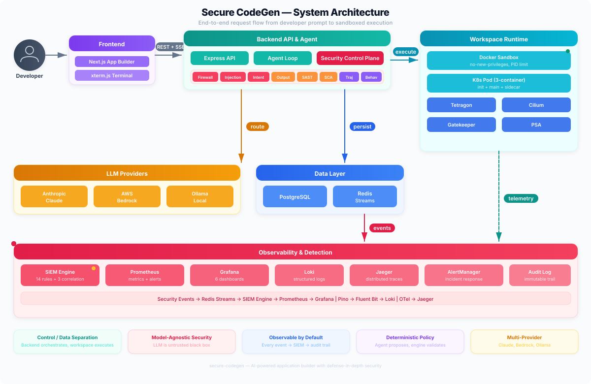
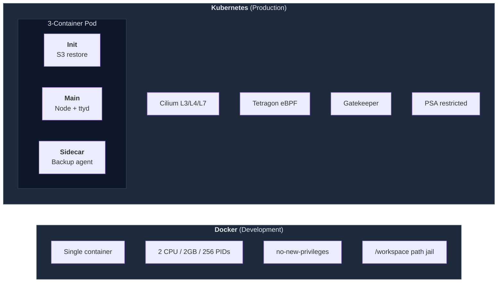
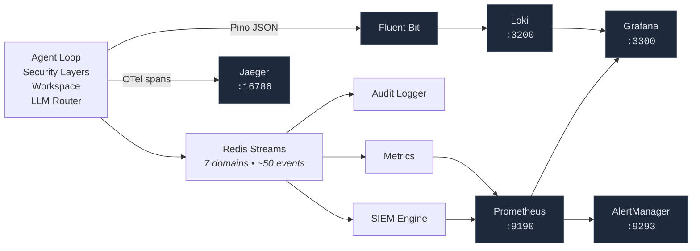
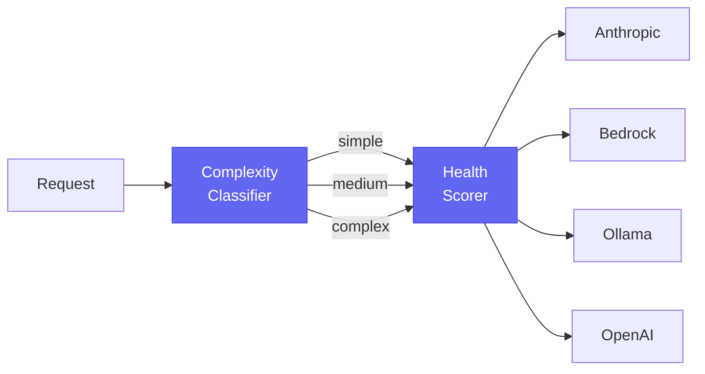

<div align="center">

# secure-codegen-factory

### Security-first AI code generation platform

Defense-in-depth controls wrapping untrusted LLMs in sandboxed workspaces

[](#tech-stack)
[](#tech-stack)
[](#workspace-isolation)
[](#kubernetes-security-controls)
[](#observability)
[](#observability)

[Quick Start](#quick-start) &bull; [Architecture](#architecture) &bull; [Security Layers](#security-layers) &bull; [K8s Controls](#kubernetes-security-controls) &bull; [Observability](#observability) &bull; [Testing](#testing) &bull; [Contributing](CONTRIBUTING.md)

</div>

---

Users describe an app in natural language. An AI agent builds it in an isolated container with live preview, code editor, and terminal. Every stage — input, inference, code generation, tool execution, deployment — is wrapped by independent security controls because **the model has no built-in security — it will generate whatever is requested**.

## Why This Exists

> **Core thesis: treat the LLM as an untrusted, non-deterministic actor.**

Security doesn't rely on model safety training. The same controls work whether the model is Claude, GPT-4, or an uncensored open-weight model. Independent layers inspect inputs, outputs, commands, packages, code, and runtime behavior. **A bypass of any single layer does not compromise the system.**

| Principle | What It Means |
|-----------|--------------|
| **Model-agnostic** | Controls work identically on safety-trained and uncensored models |
| **Control/data plane separation** | Backend orchestrates; workspaces execute. Compromised workspace can't reach control plane |
| **Deterministic policy** | Agent proposes, engine validates. Every tool call goes through explicit checks |
| **Observable by default** | Every security event flows through Redis Streams → SIEM → Prometheus → Grafana |
| **Compound controls** | Each layer catches different attack classes. Layers compose, not compete |

---

## Architecture

<a href="docs/diagrams/architecture-animated.svg">
  
</a>

---

## Security Layers

| # | Layer | Phase | Technique | Catches | Latency |
|:---:|-------|:-----:|-----------|---------|:-------:|
| 1 | **Input Firewall** | Pre-LLM | Regex + heuristic scoring | Prompt injection, delimiter injection, base64 instructions | <5ms |
| 2 | **Injection Detector** | Pre-LLM | 12 attack category analysis | DAN/jailbreak, role hijacking, encoding evasion, token smuggling | <10ms |
| 3 | **Intent Classifier** | Pre-LLM | 7-signal semantic fusion | Recon, privesc, exfiltration, resource abuse, sabotage | <20ms |
| 4 | **Secret Detector** | Pre-LLM | Pattern + Shannon entropy | AWS keys, API tokens, private keys, high-entropy strings | <5ms |
| 5 | **Output Filter** | Post-LLM | 28 BLOCK + 15 ALERT patterns | Reverse shells, pipe-to-shell, SSRF, container escape | <2ms |
| 6 | **Package Filter** | Post-LLM | Blocklist + typosquatting + age check | Malicious pkgs, typosquatting, <7 day old packages | <100ms |
| 7 | **Trajectory Monitor** | Runtime | Session risk scoring (5-turn window) | Progressive boundary testing, accumulated suspicion | <50ms |
| 8 | **Behavioral Detector** | Runtime | LLM session classification | NORMAL / SUSPICIOUS / MALICIOUS patterns | <500ms |
| 9 | **SAST Scanner** | Post-build | 20+ pattern static analysis | eval(), innerHTML, SQL injection, hardcoded creds | Variable |
| 10 | **SCA Scanner** | Post-build | npm audit | Known CVEs in dependencies | Variable |
| 11 | **Secret Scanner** | Post-build | TruffleHog-style scanning | Secrets in source files | Variable |
| 12 | **SBOM Generator** | Post-build | Dependency tree analysis | Full BOM for compliance | <100ms |
| 13 | **Image Scanner** | Pre-deploy | Trivy-based | OS package vulns, misconfigs | Variable |
| 14 | **Runtime Correlator** | Runtime | Pod label enrichment | Maps K8s events → project/user/session | <10ms |
| 15 | **SIEM Rules Engine** | Runtime | 10 detection + 3 correlation rules | Cross-layer correlation, attack patterns, flood detection | <50ms |
| 16 | **System Prompt** | Pre-LLM | Safety sandwich + canary tokens | Prompt extraction, instruction hierarchy attacks | <1ms |

<details>
<summary><b>How layers compose (bypass resistance)</b></summary>

- **Prompt injection** evading Layer 1 → caught by Injection Detector (2) or Intent Classifier (3)
- **Malicious command** from LLM → blocked by Output Filter (5) before shell execution
- **Trojan package** passing Output Filter → caught by Package Filter (6) during install
- **Gradual escalation** across turns → detected by Trajectory Monitor (7) + Behavioral Detector (8)
- **Container escape** blocked at app layer → also killed by Tetragon eBPF at kernel level
- **All events** from every layer → flow to SIEM Engine (15) for cross-layer correlation
</details>

<details>
<summary><b>OWASP LLM Top 10 mapping</b></summary>

| OWASP Risk | Layers |
|------------|--------|
| LLM01: Prompt Injection | 1, 2, 3, 16 |
| LLM02: Insecure Output | 5, 9 |
| LLM04: Model DoS | Credit engine, health scorer |
| LLM05: Supply Chain | 6, 10, 12 |
| LLM06: Sensitive Info | 4, 11 |
| LLM07: Insecure Plugin | 5 (all tool calls gated) |
| LLM08: Excessive Agency | 7, 8, sandboxed workspace |
| LLM09: Overreliance | Validation pipeline (AST + build + autofix) |
</details>

---

## SIEM Rules Engine

Real-time event correlation over Redis Streams with MITRE ATT&CK mappings.

| Rule ID | Name | Severity | MITRE | Trigger |
|:-------:|------|:--------:|:-----:|---------|
| 100001 | Prompt injection blocked | 12 | T1059 | Input firewall fires |
| 100002 | Dangerous command blocked | 10 | T1059.004 | Output filter fires |
| 100003 | Secret in input | 8 | T1552 | Credentials in user message |
| 100005 | Behavioral alert | 14 | T1059 | MALICIOUS classification |
| 100006 | Runtime alert | 13 | T1611 | Tetragon eBPF event |
| 100020 | Injection detected | 12 | T1059 | Deep detector fires |
| 100022 | High-risk intent | 13 | T1203 | EXFILTRATION or SABOTAGE |

**Correlation rules** detect compound attacks:

| Rule | Trigger | Window |
|------|---------|--------|
| Coordinated attack | 3+ security events | 5 min |
| Injection flood | 5+ injection events | 10 min |
| Sandbox escape sequence | 3+ command blocks | 5 min |

---

## Workspace Isolation

Two runtime backends, same API surface:



---

## Kubernetes Security Controls

<details>
<summary><b>Cilium Network Policies (9 rules)</b> — Default-deny with explicit allow-list</summary>

| Policy | Type | Effect |
|--------|------|--------|
| `default-deny-all` | L3/L4 | Block ALL traffic (baseline) |
| `allow-dns` | L3/L4 | DNS to kube-dns only |
| `allow-package-registries` | L7 FQDN | npm, yarn, PyPI, GitHub on 443 |
| `allow-system-ingress` | L3/L4 | Control plane → workspace |
| `allow-localstack-egress` | L3/L4 | Workspace → S3 |
| `block-metadata-ssrf` | L3 CIDR | Block 169.254.169.254 |
| `deny-inter-workspace` | L3 | Tenant isolation |
| `l7-http-visibility` | L7 HTTP | Hubble flow logging |
</details>

<details>
<summary><b>Tetragon eBPF (5 policies)</b> — Kernel-level enforcement with SIGKILL</summary>

| Policy | Trigger | Action |
|--------|---------|--------|
| `workspace-process-monitor` | `sys_execve` | Log escape tools, miners, reverse shells |
| `workspace-kill-escape` | nsenter/unshare/chroot | **SIGKILL** |
| `workspace-file-monitor` | `sys_openat` | Log /etc/shadow, docker.sock |
| `workspace-kill-sa-token` | K8s SA token access | **SIGKILL** |
| `workspace-network-monitor` | Connect to metadata | **SIGKILL** |
</details>

<details>
<summary><b>OPA Gatekeeper (7 constraints)</b> — Admission control</summary>

| Constraint | Blocks |
|-----------|--------|
| `workspace-no-privileged` | Privileged containers |
| `workspace-require-limits` | Missing resource limits |
| `workspace-require-seccomp` | Missing seccomp |
| `workspace-require-nonroot` | Root containers |
| `workspace-no-host-ns` | Host namespaces |
| `workspace-restrict-volumes` | hostPath volumes |
| `workspace-no-priv-esc` | Privilege escalation |
</details>

---

## Observability



**6 Grafana Dashboards**: Security | Agent | LLM | Workspace | Network | Incidents

**Key Metrics**: `security_blocks_total` `llm_call_duration_seconds` `agent_iterations_total` `active_workspaces` `siem_alerts_total` `provider_health_score`

**50+ Alert Rules** across 5 groups: security detections, app health, infrastructure, LLM health, workspace health

---

## LLM Router

Multi-provider routing with health-based failover:



| Provider | Models | Config |
|----------|--------|--------|
| Anthropic | Claude Opus 4.6, Sonnet 4.6, Haiku 4.5 | `ANTHROPIC_API_KEY` |
| AWS Bedrock | Same via Bedrock | `AWS_ACCESS_KEY_ID` |
| Ollama | Any local model (default: qwen3:0.6b) | `OLLAMA_BASE_URL` |
| OpenAI | GPT-4o, GPT-4o-mini | `OPENAI_API_KEY` |

---

## Testing

| Suite | Count | What It Validates |
|-------|:-----:|-------------------|
| Unit tests | 262 | All security layers, router, billing, validation, events |
| Attack regression | 48 vectors | 15 attack categories against live security stack |
| E2E pipeline | 9 | Full chain: API → SIEM → Prometheus → Loki |

```bash
npm test                                  # unit tests
npm run test:security:regression          # 48-vector attack suite
npm run test:security:pipeline            # E2E security pipeline
npm run test:security:model-regression    # compare models side-by-side
```

<details>
<summary><b>Layer detection coverage</b></summary>

| Layer | Coverage |
|-------|:--------:|
| secret_detector | 100% |
| package_filter | 100% |
| intent_classifier | 88% |
| output_filter | 86% |
| input_firewall | 67% |
| injection_detector | 57% |
| network_cilium | K8s only |
| runtime_tetragon | K8s only |
</details>

---

## Quick Start

```bash
# One command — deps, infra, DB, workspace image, smoke tests
./scripts/bootstrap.sh

# With Kubernetes (Kind + Cilium + Tetragon + Gatekeeper)
./scripts/bootstrap.sh --k8s
```

**Prerequisites**: Docker (or Colima) &bull; Node.js 20+ &bull; [Ollama](https://ollama.com) (recommended)

<details>
<summary><b>Manual setup</b></summary>

```bash
cp .env.example .env
npm install
docker compose -f docker-compose.yml -f docker-compose.monitoring.yml up -d
npx prisma db push && npx tsx prisma/seed.ts
docker build -f Dockerfile.workspace -t devfactory-workspace:latest .
npm run dev
```
</details>

<details>
<summary><b>Service URLs</b></summary>

| Service | URL | Auth |
|---------|-----|------|
| Frontend | http://localhost:3100 | — |
| Backend API | http://localhost:4100/api/health | — |
| Grafana | http://localhost:3300 | admin/admin |
| Prometheus | http://localhost:9190 | — |
| Jaeger | http://localhost:16786 | — |
| Loki | http://localhost:3200 | — |
| AlertManager | http://localhost:9293 | — |
| Keycloak | http://localhost:8280 | admin/admin |
| Traefik | http://localhost:8190 | — |
</details>

---

## Project Structure

```
secure-codegen-factory/
├── src/
│   ├── app/                      # Next.js frontend (Home, Workspace, Admin)
│   ├── components/               # ChatPanel, CodeEditor, Preview, Terminal, SecurityDashboard
│   └── server/
│       ├── security/             # Defense-in-depth security layers
│       ├── llm/                  # Multi-provider router + health scorer
│       ├── routes/               # Express API endpoints
│       ├── services/             # Workspace, agent-loop, docker, k8s, snapshot
│       ├── events/               # Redis Streams event bus + audit
│       ├── observability/        # Prometheus, OTel tracing, Pino logging
│       ├── validation/           # AST validator, build verifier, autofix
│       ├── billing/              # Credit engine + double-entry ledger
│       └── deploy/               # Framework detect, Dockerfile gen, deploy gate
├── k8s/                          # Cilium, Tetragon, Gatekeeper, Kind setup
├── grafana/                      # 6 dashboard JSONs + provisioning
├── prometheus/                   # Alert rules + AlertManager
├── tests/                        # 262 unit + 48 regression + E2E pipeline
├── docs/                         # Detailed docs by topic
├── scripts/bootstrap.sh          # One-command setup
├── docker-compose.yml            # 8 core services
├── docker-compose.monitoring.yml # 4 observability services
├── Dockerfile.workspace          # Sandboxed workspace image
└── Dockerfile.sidecar            # Distroless backup agent
```

---

## Tech Stack

| Layer | Technology |
|-------|-----------|
| **Frontend** | Next.js 15, React 18, Tailwind CSS, Monaco Editor, xterm.js |
| **Backend** | Express, TypeScript (strict), Prisma ORM (13 models) |
| **LLM** | Anthropic Claude, AWS Bedrock, Ollama, OpenAI-compatible |
| **Database** | PostgreSQL 16, Redis 7 (Streams + cache) |
| **Containers** | Docker (dev), Kubernetes + Kind (production) |
| **Network** | Cilium CNI (L3/L4/L7 + FQDN egress control) |
| **Runtime** | Tetragon eBPF (SIGKILL enforcement on escape attempts) |
| **Admission** | OPA Gatekeeper (7 constraints), PSA restricted |
| **Observability** | Prometheus, Grafana (6 dashboards), Loki, Jaeger, AlertManager |
| **Logging** | Pino (structured JSON) → Fluent Bit → Loki |
| **Auth** | Keycloak OIDC, JWT with verified signatures |
| **Testing** | Jest, 48-vector regression harness, Playwright |
| **Billing** | Double-entry credit ledger with reservation pattern |

---

<details>
<summary><b>Documentation index</b></summary>

**Security**: [Overview](docs/security/README.md) &bull; [Input Firewall](docs/security/input-firewall.md) &bull; [Output Filter](docs/security/output-filter.md) &bull; [Injection Detection](docs/security/injection-detection.md) &bull; [Intent Classification](docs/security/intent-classification.md) &bull; [SIEM Engine](docs/security/siem-engine.md) &bull; [K8s Runtime](docs/security/kubernetes-runtime.md)

**Architecture**: [System Overview](docs/architecture/README.md) &bull; [LLM Pipeline](docs/architecture/llm-pipeline.md) &bull; [Workspace Lifecycle](docs/architecture/workspace-lifecycle.md) &bull; [Event System](docs/architecture/event-system.md)

**Operations**: [Observability](docs/observability/README.md) &bull; [Infrastructure](docs/infrastructure/README.md) &bull; [Testing](docs/testing/README.md)

**Playbooks**: [Prompt Injection](docs/playbooks/prompt-injection.md) &bull; [Sandbox Escape](docs/playbooks/sandbox-escape.md) &bull; [Supply Chain](docs/playbooks/supply-chain-attack.md) &bull; [Data Exfiltration](docs/playbooks/data-exfiltration.md)
</details>

## Contributing

See [CONTRIBUTING.md](CONTRIBUTING.md) for development workflow, testing requirements, and contribution guidelines.
